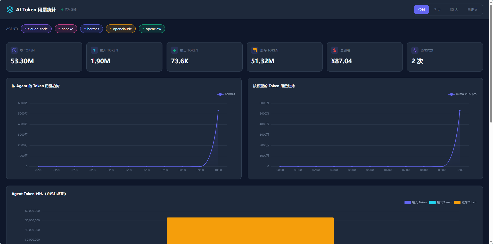

# AI Token Usage Statistics

[](LICENSE)
[](https://www.python.org/downloads/)
[](https://svelte.dev/)

## 截图



在 Windows / WSL 上运行的 Web 仪表盘，用于监控和可视化 WSL 中多个 AI 编程 Agent 的 Token 消耗与费用。

## 功能特性

- **多 Agent 支持**：采集 Claude Code、Hermes（WSL + Windows）、OpenClaw、OpenClaude 的 Token 用量
- **实时仪表盘**：基于 SSE 推送更新，无需刷新页面
- **费用估算**：内置各模型定价（YAML 配置，支持热更新），自动计算使用成本
- **人民币显示**：所有费用以人民币（¥）显示，支持一键从 OpenRouter 获取最新定价
- **丰富图表**：Agent Token 对比图、Agent 消耗占比饼图、模型分布条形图（ECharts）
- **时间范围筛选**：今日 / 7 天 / 30 天 / 自定义区间
- **分页与搜索**：使用记录和模型定价表支持分页（10/20/50 条）和搜索
- **可扩展采集器**：实现 `BaseCollector` 即可接入新 Agent
- **双环境运行**：Windows 原生部署（UNC 路径）和 WSL 内开发测试（自动检测）

## 系统架构

```
Windows 原生 或 WSL 内运行
┌────────────────┐    SSE     ┌──────────────────────┐
│  Svelte SPA    │◄──────────│  FastAPI Server       │
│  (浏览器)      │           │  ├─ SQLite 数据库     │
└────────────────┘           │  └─ 采集器            │
                             └────────┬─────────────-┘
                                      │ UNC / 原生路径
                             ┌────────┴──────────────┐
                             │       WSL             │
                             │  Claude Code (claude) │
                             │  Hermes (root)        │
                             │  OpenClaw (root)      │
                             └──────────────────────-┘

                             ┌────────────────────────┐
                             │     Windows 本地        │
                             │  Hermes-Win (用户)      │
                             │  OpenClaude (用户)      │
                             └────────────────────────┘
```

后端设计为 Windows 原生部署，通过 UNC 路径 (`\\wsl$\project-claude\...`) 访问 WSL 中的 Agent 数据文件。在 WSL 内开发测试时也能运行——自动检测 `is_wsl` 环境变量，使用 Linux 原生路径。

## 技术栈

| 层级 | 技术 |
|------|------|
| 后端 | Python 3.11+, FastAPI, aiosqlite, Pydantic, PyYAML |
| 前端 | Svelte 5, TypeScript, ECharts, TailwindCSS, Vite |
| 数据库 | SQLite |
| 实时通信 | Server-Sent Events (SSE) |

## 快速开始

### 环境要求

- Python 3.11+
- Node.js 18+
- WSL 中至少安装了一个 AI Agent

### 后端

```bash
# 创建虚拟环境并安装依赖
python -m venv .venv

# Windows 原生部署
.venv\Scripts\activate
# WSL 内开发测试
source .venv/bin/activate

pip install -e ".[dev]"

# 启动服务
uvicorn backend.main:app --reload
```

> 在 WSL 内运行时会自动检测环境，使用 Linux 原生路径访问数据文件。

### 前端

```bash
cd frontend
npm install
npm run dev        # 开发服务器
npm run build      # 生产构建（由 FastAPI 托管）
```

### 配置项

通过环境变量或 `config.py` 配置（前缀 `TOKEN_STAT_`）：

| 变量 / 配置项 | 默认值 | 说明 |
|--------------|--------|------|
| `wsl_distro` / `TOKEN_STAT_WSL_DISTRO` | `project-claude` | WSL 发行版名称 |
| `wsl_user_accessible` | `claude` | UNC 可访问的 WSL 用户（数据可通过 UNC 读取） |
| `wsl_user_root` | `root` | root 权限用户（用于通过 `wsl.exe -u root -- cp` 复制 /root/ 下的数据） |
| `poll_interval_seconds` / `TOKEN_STAT_POLL_INTERVAL_SECONDS` | `5` | 采集器轮询间隔（秒） |
| `db_path` / `TOKEN_STAT_DB_PATH` | `data/token_statistic.db` | 本地 SQLite 数据库路径 |
| `TOKEN_STAT_HOST` | `127.0.0.1` | 服务绑定地址 |
| `TOKEN_STAT_PORT` | `8001` | 服务端口 |

### 数据源路径

| Agent | 数据文件 | WSL 路径 | Windows UNC 路径 |
|-------|---------|---------|-----------------|
| Hermes (WSL) | state.db (SQLite) | `/root/.hermes/state.db` → 复制到 `/tmp/hermes_state.db` | `\\wsl$\project-claude\tmp\hermes_state.db` |
| Hermes (Windows) | state.db (SQLite) | — | `%LOCALAPPDATA%\hermes\state.db`（Windows 本地，直接读取） |
| Claude Code | session JSONL | `/home/claude/.claude/projects/**/*.jsonl` | `\\wsl$\project-claude\home\claude\.claude\projects\`（递归扫描） |
| OpenClaw | sessions.json | `/root/.openclaw/agents/main/sessions/sessions.json` → 复制到 `/tmp/openclaw_sessions.json` | `\\wsl$\project-claude\tmp\openclaw_sessions.json` |
| OpenClaude | session JSONL | — | `%USERPROFILE%\.openclaude\projects\**\*.jsonl`（Windows 本地，直接读取） |

> **权限说明**：Hermes（WSL）和 OpenClaw 的数据在 `/root/` 下（权限 700），WSL 默认用户 `claude` 无法通过 UNC 访问。采集器会在每次采集前通过 `wsl_copy_to_tmp()` 将文件复制到 `/tmp/`（chmod 644），然后读取副本。Windows 部署时用 `wsl.exe -u root -- cp` 执行复制；WSL 内测试时直接用 `shutil.copy2`。Claude Code 的数据在 `claude` 用户目录下，无权限问题。Hermes（Windows）的数据在 `%LOCALAPPDATA%` 下，当前用户直接可读。

### Agent 配置

- **Hermes (WSL)** 和 **OpenClaw**：无需配置，采集器自动读取数据文件。
- **Hermes (Windows)**：无需配置，采集器直接读取 `%LOCALAPPDATA%\hermes\state.db`。与 WSL 版采集器独立运行，agent 名称为 `hermes-win`，互不干扰。
- **Claude Code**：无需配置。采集器扫描 `~/.claude/projects/` 下所有 session JSONL 文件，提取 `message.usage` 中的 token 数据。零侵入，无需在 Claude Code 中做任何操作。
- **OpenClaude**：无需配置。采集器扫描 Windows 本地 `%USERPROFILE%\.openclaude\projects\` 下所有 session JSONL 文件，数据格式与 Claude Code 相同。无需 WSL 路径转换或权限处理。

详见 [Agent 配置指南](docs/agent-setup-guide.md)。

## API 接口

| 方法 | 路径 | 说明 |
|------|------|------|
| GET | `/api/summary` | 汇总统计，含按 Agent/模型/日期的明细 |
| GET | `/api/usage` | 分页查询使用记录 |
| GET | `/api/agents` | 获取已追踪的 Agent 列表 |
| GET | `/api/models` | 获取模型列表及定价 |
| GET | `/api/stream` | SSE 实时推送流 |
| GET | `/api/pricing` | 获取所有模型定价 |
| PUT | `/api/pricing/{model}` | 更新指定模型定价 |
| POST | `/api/pricing/refresh` | 从 OpenRouter 一键更新所有模型定价 |

### 请求示例

```bash
# 今日汇总（按北京时间 0 点起算）
curl "http://localhost:8001/api/summary?range=today"

# 按 Agent 和模型筛选
curl "http://localhost:8001/api/summary?range=7d&agent=claude-code&model=claude-sonnet-4-6"

# 最近使用记录（支持 range 参数）
curl "http://localhost:8001/api/usage?range=today&page=1&limit=50"

# 不指定 range 时按 from/to 筛选
curl "http://localhost:8001/api/usage?from=2026-05-01&to=2026-05-07"
```

> **时区说明**：`range=today`、`7d`、`30d` 均按本地时区（Asia/Shanghai）计算零点起止时间，数据库中存储的 timestamp 为 UTC 格式。前端同样使用本地日期生成 from/to 参数，确保跨时区一致性。

## 项目结构

```
ai-token-usage-statistics/
├── backend/
│   ├── main.py              # FastAPI 应用入口
│   ├── config.py            # pydantic-settings 配置
│   ├── api/                 # REST + SSE 接口
│   ├── collectors/          # 各 Agent 数据采集器
│   ├── db/                  # SQLite 连接与表结构
│   └── pricing/             # 模型定价与费用计算
├── frontend/
│   └── src/
│       ├── App.svelte       # 主应用组件
│       ├── components/      # StatCard, TrendChart, AgentPie 等
│       ├── api/             # 请求封装 + SSE 客户端
│       └── types/           # TypeScript 类型定义
├── tests/                   # pytest 测试用例
├── config/                  # 模型定价 YAML 配置
├── scripts/                 # 工具脚本（费用重算等）
├── docs/                    # 设计文档、配置指南
└── pyproject.toml           # Python 项目配置
```

## 测试

```bash
# 运行全部测试
pytest

# 带覆盖率报告
pytest --cov=backend --cov-report=term-missing

# 代码检查
ruff check backend/ tests/
```

## 许可证

[MIT License](LICENSE)
